# Operationalizing Machine Learning

## Overview
This project is part of the Udacity Azure ML Nanodegree.

In this project, we use Azure to **configure a cloud-based machine learning production model, deploy it, and consume it**.
We will also create, publish, and consume a pipeline.

## Architectural Diagram

In this project, we explain briefly how to publish your best AutoML model and deploy it as a Web API.

- **Experiment Run**: Using MLStudio we manually upload data, select the compute 
  target and the task we want to accomplish
- **Best Model Selection**: Comparing all the models, finally we choose the one with better primary metric, in this case, weighted AUC, according to the target unbalance.
- **Model Deployment**: The best model is deployed as an endpoint.
- **Application Insights Activation**: We enable this logs monitoring tool.
- **Display Swagger Documentation**: We make use of the *swagger.json* file
 given by Azure to visualize documentation in a more clear and professional way.
- **Consume Endpoint**: We do a test and a benchmark to check out that the 
endpoint works and to better know latency times.
- **Create, Publish and Consume a Pipeline using Python SDK**: In the top of 
Automation we have the pipelines. Processing data and retraining only with an
HTTP request is possible.

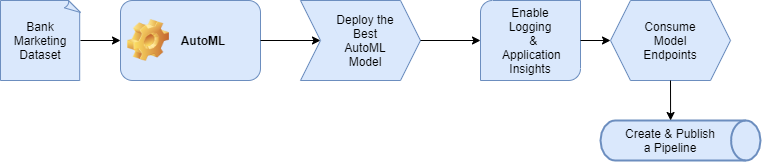

## Key Steps
### **1. Data Preparation**: When AutoML run is created, *Bank-Marketing* data is uploaded and registered so that we can use it in our experiments.

Given the *bank-marketing.csv* file, we upload it to Datasets section so that
we can do a quick exploration before using it. In addition to that, in "Consume"
tab Azure gives us an example of python code chunk to retrieve data and dive into
it using pandas library.

One of the most important keys before thinking about models is to be familiar 
with the data available for modeling and the distribution of the target variable.
In this case, the target feature is called "y" and has a particular 
characteristic: distribution of yes/no is not uniform, i.e., we have much more
no than yes so that we say that we have high unbalancement. There are many ways 
to solve this problem (resampling, choosing a right metric, ...) and none of 
them is better than other. We have to choose accordingly to the task we are 
acomplishing. 

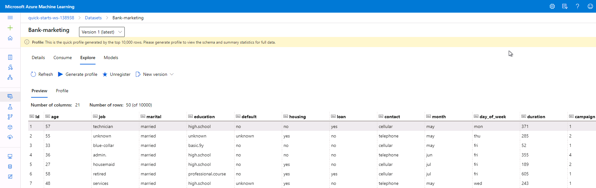    

   **Personal information**: Occupation, age, marital status and education.

   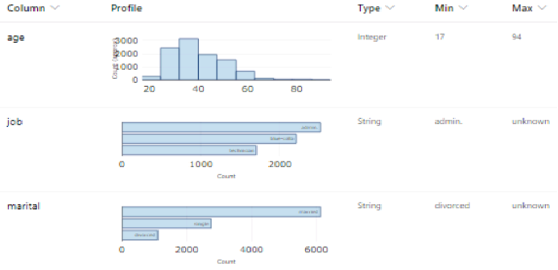

   **Financial information**: Debts and other data about customer's financial health.

   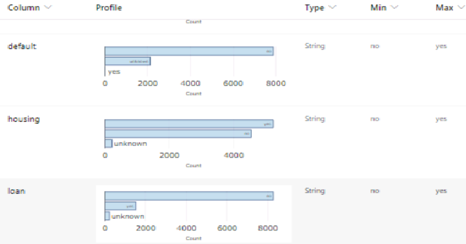

   **Target**: The variable we seek to predict is the one that tells us if a given person is a potential client or not.
   
   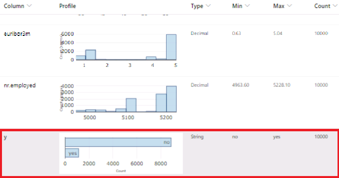
   <!--  -->
### **2. Experiment Run**: AutoML experiment correctly run and submitted.

Once we have some sensitivity about data, we are going to train a classifier 
using an ML model. Modeling is an art but we have some interesting tools that 
help us to obtain an acceptable ML model without doing much feature engineering.
This is the case of AutoML models. These tools work by comparing different 
candidate algorithms and hyperparameters so that computational cost is high.

Azure AutoML module is optimised to do this tasks in a more efficient way than
if a normal person develops by himself. To this fact, we add the possibility of
using powerful servers on demand to run this tasks so the more yo need (and pay)
the more you have. These servers where AutoML runs are called Computer Instances
(or compute targets).

This told, to run an AutoML experiment using Azure Portal first we go to AutoML
module in the sidebar and name the **new experiment** as *p2-ml_ops_udacity*.
Then, a *Standard_DS12_v2* **compute cluster is configured** with minimum 
number of nodes equal to 1 and maximum of 6. We call it *p2-azure compute*.

Finally, a *Classification* task is selected. On *Exit Criterion* we reduce the 
default (3 hours) to 1, because we think it is enough to get a good model for 
this particular task, and reduce the *Concurrency* from default to 5 (this number
should always be less than the number of the compute clusters). 

<!-- 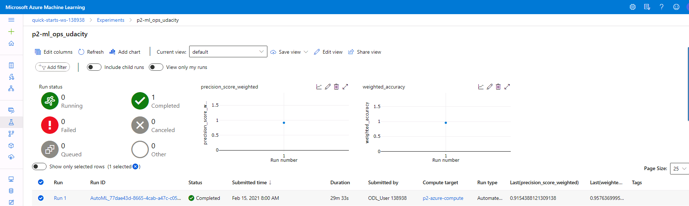 -->

<figure>
    
    <figcaption style="text-align:center">Figure 1: Successful AutoML experiment run on p2-azure-compute cluster</figcaption>
</figure>

### **3. Best Model**: The best performing model is the one using *VotingEnsemble*.

After the experiment run completes, a summary of all the models and their metrics are shown, including explanations. The Best Model will be shown in the Details tab. In the Models tab, it will come up first (at the top). Make sure you select the best model for deployment.

Deploying the Best Model will allow to interact with the HTTP API service and interact with the model by sending data through POST requests.

<!-- 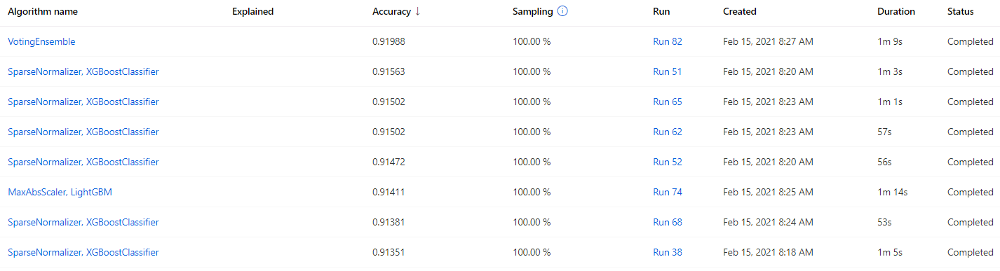
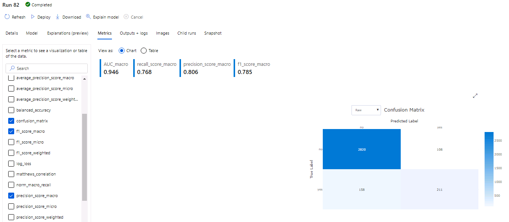 -->

<figure>
    
    <figcaption style="text-align:center">Figure 2: List of Models sorted by Primary Metric performance</figcaption>
</figure>

In Figure 3, best model performance is shown in *Metrics* tab. Although Accuracy 
was used as a Primary Metric, target unbalancing suggests us to pay moer attention
to macro-metrics.

* Micro-averaged: all samples equally contribute to the final averaged metric
* Macro-averaged: all classes equally contribute to the final averaged metric
* Weighted-averaged: each classes’s contribution to the average is weighted by its size

You can find an interesting example [here](https://www.mariakhalusova.com/posts/2019-04-17-ml-model-evaluation-metrics-p2/).

<figure>
    
    <figcaption style="text-align:center">Figure 3: Best classification model performance with macro-metrics and confusion matrix</figcaption>
</figure>

### **4. Deploy Model**: Create an endpoint associated to an ACI.
We choose the best model for deployment and enable "Authentication" while 
deploying the model using Azure Container Instance (ACI). The executed code in
logs.py enables Application Insights. "Application Insights enabled" is disabled
before executing logs.py.

The new endpoint name is `demo-model-deploy` and every authorized request to 
it can interact with the trained model.

<!-- 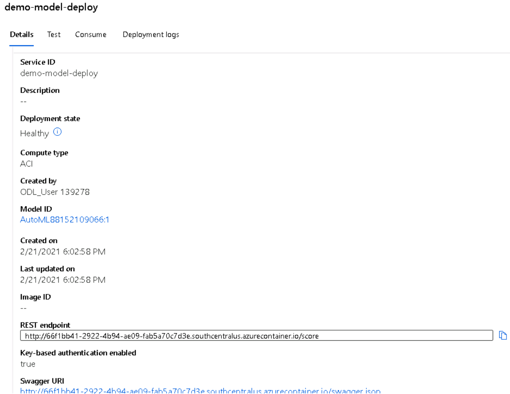   -->
<!-- <figure>
    
    <figcaption style="text-align:center">Figure 4: Best model HTTP endpoint with enabled Application Insights</figcaption>
</figure> -->

#### **4.1. Activate Application Insights**:
First of all, we check out that *az* extension is installed with `az version` 
and `az extension add -n azure-cli-ml` commands.

Before running any python scripts, it is important to create a python virtual 
environment with `virtualenv venv`. One activated the virtual environment, we can
edit and run logs.py writing the endpoint name `demo-model-deploy` and see the 
console output-

<figure>
    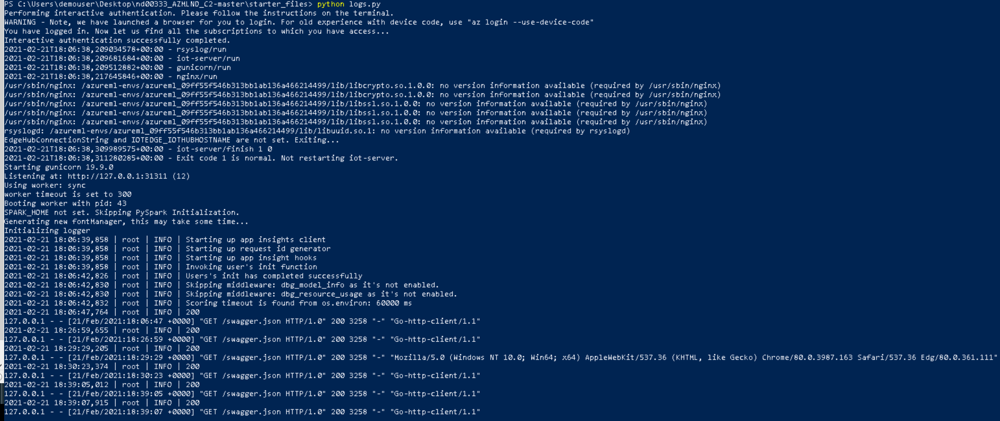
    <figcaption style="text-align:center">Figure 4: logs.py script output</figcaption>
</figure>

Finally we can check that Applications insights is enabled in the endpoint 
Details tab and, if we click the url below, we can see the application's activity 
report.

<!-- 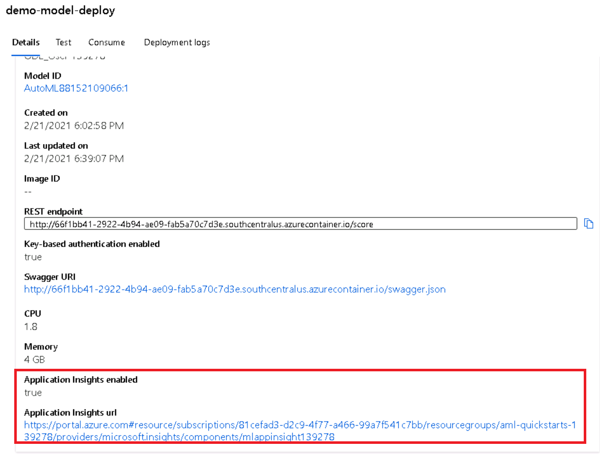 -->
<figure>
    
    <figcaption style="text-align:center">Figure 5: Proof of Applications Insights activation</figcaption>
</figure>

<!-- 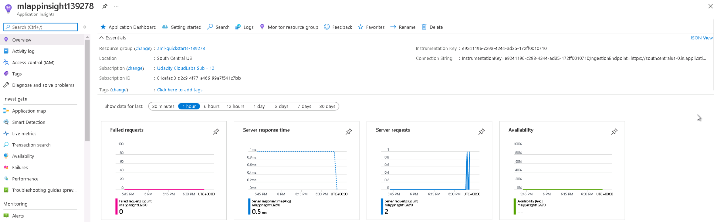 -->

The activity report displays some graphs showing status, failed requests and 
response time during the periods whch the endpoint is working.
<figure>
    
    <figcaption style="text-align:center">Figure 6: Endpoint activity report</figcaption>
</figure>

### **5. Display Swagger Documentation**
If we go back to the endpoint Details tab, a URL to a swagger.json file can be found.
We donwload it into ./swagger/swagger.json file. This is going to be used to format
API documentation in Swagger UI app.

In swagger.sh script, `swagger-ui` docker image is downloaded so that we can start
containers on it. We map local port 9000 to the 8080 in the container, where swagger
is running. This way, Swagger UI app is running on http://localhost:9000/.

For CORS activation, we have to run server.py in 8000 port and after that check 
http://localhost:8000/swagger.json in `Swagger` search bar.

<figure>
    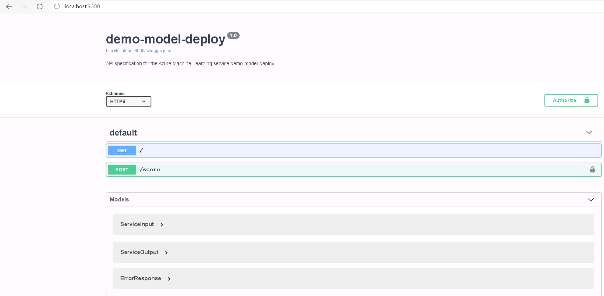
    <figcaption style="text-align:center">Figure 7: Swagger documentation for demo-model-deploy</figcaption>
</figure>

### **6. Consume Endpoint and benchmarking**

In software development, everything has to be tested and monitorized. To test our
endpoint does correctly its work, we run endpoint.py to send a test POST request
to the API. To do that, we create data.json example file from a python dictionary 
hardcoded into endpoint.py and send it using python requests library.

<!-- 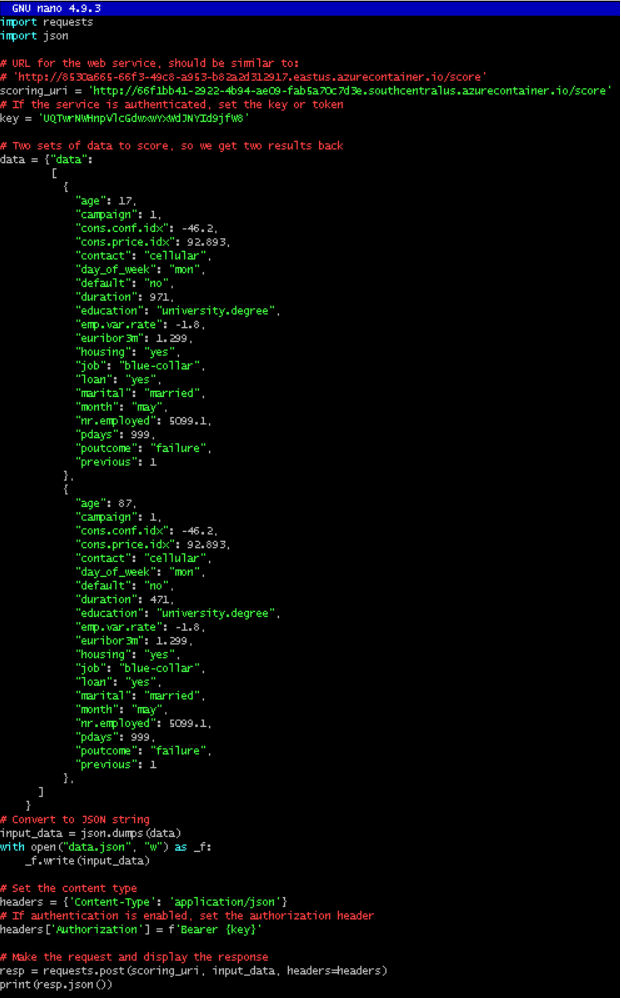 -->

<figure>
    
    <figcaption style="text-align:center">Figure 8: Endpoint test request</figcaption>
</figure>

The obtained output is the class corresponding to the 2 samples sent.

<!-- 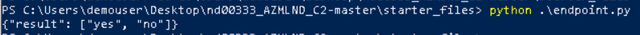 -->
<figure>
    
    <figcaption style="text-align:center">Figure 9: Endpoint response for test samples</figcaption>
</figure>

Now we want to know the average time needed by the endpoint to process requests 
and send responses. For that we use **Apache Benchmark**, a tool for benchmarking
your Apache Hypertext Transfer Protocol (HTTP) server. It is designed to give 
you an impression of how your current Apache installation performs. This 
especially shows you how many requests per second your Apache installation is 
capable of serving. More info [here](https://httpd.apache.org/docs/2.4/programs/ab.html). 

First of all we check that it is installed displaying the help `ab -h`. Once we
see that it works, Authorization key and URI can be introduced into benchmark.sh
and run the script.

<!-- 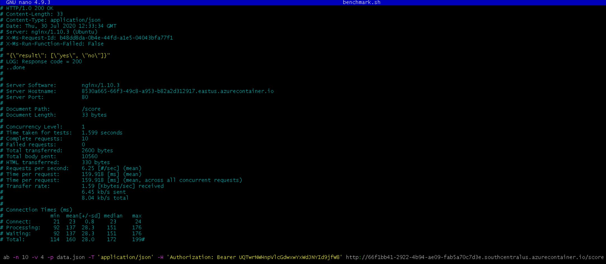 -->

<figure>
    
    <figcaption style="text-align:center">Figure 10: benchmark.sh script content </figcaption>
</figure>

<!-- 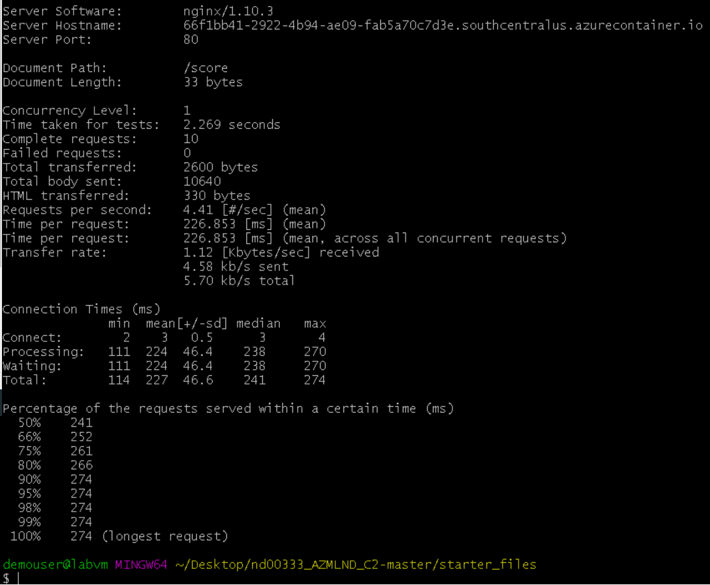 -->

<figure>
    
    <figcaption style="text-align:center">Figure 11: Benchmarking results </figcaption>
</figure>

We can see that, calling 10 times the API with data.json POST (the 
same used for testing the endpoint), all of them are done without issues in 
226 ms in average. This is a very acceptable responsing time fro the majority of
the real applications purposes.

### **7. Create, Publish and Consume a Pipeline**

#### **Introduction to Pipelines**
Pipelines are all about Automation. Automation connects different services and 
actions together to be part of a new workflow that wasn’t possible before.

There are some good examples of how different services can communicate to the 
pipeline endpoint to enable automation.

* A hosted project using version control: when a new change gets merged, a trigger
is created to send an HTTP request to the endpoint and train the model.

* A newer dataset gets uploaded to a storage system that triggers an HTTP request 
to the endpoint to re-train the model.

* Several teams that want to use AutoML with datasets that are hosted externally 
can configure the external cloud provider to trigger an HTTP request when a new dataset gets saved.

* A CI /CD platform like Jenkins, with a job that submits an HTTP request to Azure when it completes without error.

Pipeline endpoints can be consumed via HTTP, but it is also possible to do so 
via the Python SDK. Since there are different ways to interact with published 
Pipelines, this makes the whole pipeline environment very flexible.

It is key to find and use the correct HTTP endpoint to interact with a published
pipeline. Sending a request over HTTP to a pipeline endpoint will require 
authentication in the request headers.

#### **Process**

In this part of the project, we create, publish and consume a Pipeline using 
Python SDK.

The first step to do it is to upload the Jupyter Notebook that contains the 
process of the Pipeline creation and change the experiment name so that it's the
same used for AutoML `p2-ml_ops_udacity`.

To facilitate Workspace detection via Python SDK, the config.json file with the 
info about the workspace is downloaded from Azure Portal and uploaded to the 
notebook folder.

Using Python SDK and the uploadeed notebook, we run the AutoML step and publish
the Pipeline so that we can find it in MLStudio Pipelines section.

<!-- 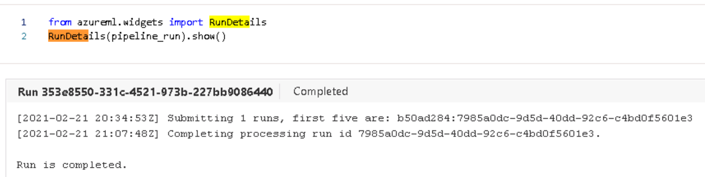 -->
<figure>
    
    <figcaption style="text-align:center">Figure 12: Details about AutoML experiment run using Python SDK </figcaption>
</figure>

<!-- 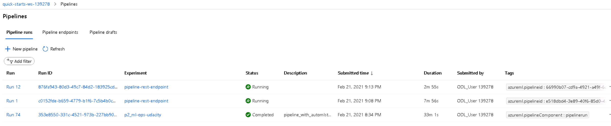 -->

<figure>
    
    <figcaption style="text-align:center">Figure 13: Running pipeline on Machine Learning Studio Pipelines section </figcaption>
</figure>

When the run is completed, we finally deploy it so that it can be run again as 
many times as it is needed using HTTP request.

<figure>
    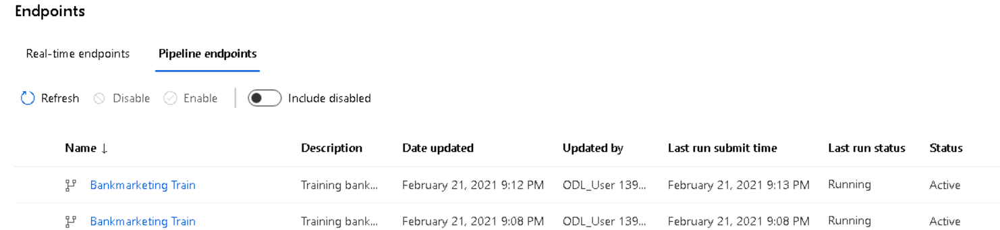
    <figcaption style="text-align:center">Figure 14: Available Pipeline Endpoints in ML Studio Endpoints section </figcaption>
</figure>

<!-- 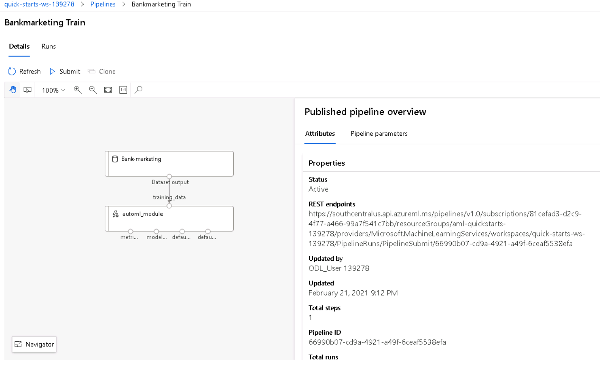 -->

If we acess to the deployed Pipeline endpoint, we can check that all the steps 
are included, in this case the data ingestion and the AutoML Step. The URL to
call the endpoint is available too. It can be accessed to it using typical HTTP
authorized request but, usually, it is prefered to do it using Azure Python SDK
for security and to have everything integrated in the same platform.

<figure>
    
    <figcaption style="text-align:center">Figure 15: Active Pipeline workflow with endpoint URL</figcaption>
</figure>

## Screen Recording
Clicking on the following picture you can watch a **5 minutes video** with 
explanations about the content of the project.

[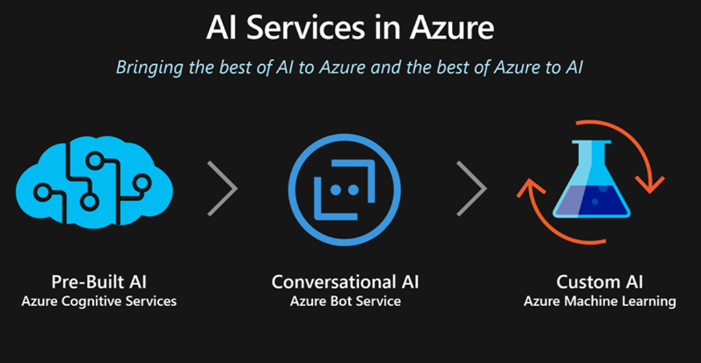](https://youtu.be/NDL4-IqeMsU)

## Standout Suggestions

For future work, I would suggest making further tweaks to the AutoML step of the pipeline. There are a lot of settings involved and making changes to them could improve the search space and help find an even better model solution. There are also additional steps that could be added to the pipeline, perhaps doing some dataset cleanup or feature engineering before the AutoML step, or doing additional steps after the AutoML step has completed.

In addition, I propose connecting Application Insights to our Pipeline API and 
Scheduling periodical runs or each time Banking Dataset updates (trigger). 
